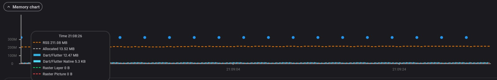

# Ingredio

A Flutter application that helps users discover recipes based on the ingredients they already have at home. Users build a virtual pantry, and the app fetches matching recipes from a live API — sorted by how many ingredients they already have.

**Course:** Mobile Applications — THWS / TAMK  
**Submission deadline:** 2026-05-30

## Authors

| Name | University |
|------|------------|
| Sofiia Khyzhnychenko | THWS |
| Anastasia Pylova | TAMK |
| Halil Hakan Karabay | THWS |
| Armanc Beler | THWS |

---

## Table of Contents

- [Features](#features)
- [Screenshots](#screenshots)
- [Getting Started](#getting-started)
- [Project Structure](#project-structure)
- [Architecture](#architecture)
- [State Management](#state-management)
- [Data Layer](#data-layer)
- [Screens](#screens)
- [Packages](#packages)
- [Performance](#performance)
- [Testing](#testing)

---

## Features

- **Pantry screen** — browse a full ingredient list fetched from the MealDB API, search and select up to 30 ingredients, assign quantities per ingredient
- **Discover screen** — recipes matched and ranked by the number of selected ingredients; real-time search/filter bar
- **Recipe detail screen** — full instructions, ingredient list with measures, category, YouTube video link, and share button
- **Favorites screen** — persist and manage favourite recipes offline
- **Profile screen** — user registration (name), editable profile, recipe collections, dietary preferences, account management (logout / delete all data)
- **Offline support** — Hive local cache for recipes and ingredient lists; connectivity check with graceful error state and retry
- **Share recipes** — share recipe name and details via the system share sheet

---

## Screenshots

### Design System


### App Screens

<table>
  <tr>
    <td align="center"><strong>Register</strong></td>
    <td align="center"><strong>Discover</strong></td>
    <td align="center"><strong>Pantry</strong></td>
    <td align="center"><strong>Recipe Detail</strong></td>
    <td align="center"><strong>Profile</strong></td>
  </tr>
  <tr>
    <td></td>
    <td></td>
    <td></td>
    <td></td>
    <td></td>
  </tr>
</table>

---

## Getting Started

### Prerequisites

- Flutter SDK **3.24.3** or later (Dart SDK **3.5.3** or later)
- Android emulator / physical device (Android 6.0+) or iOS Simulator (iOS 14+)

### Installation

1. Clone the repository:
   ```sh
   git clone https://github.com/soffffises/Ingredio.git
   cd Ingredio
   ```

2. Install dependencies:
   ```sh
   flutter pub get
   ```

3. Generate Hive adapters (already committed, only needed after model changes):
   ```sh
   dart run build_runner build --delete-conflicting-outputs
   ```

4. Run on a connected device or emulator:
   ```sh
   flutter run
   ```

### Build for release

```sh
# Android APK
flutter build apk --release

# iOS (requires macOS + Xcode)
flutter build ios --release
```

### Run tests

```sh
flutter test
```

---

## Project Structure

```
lib/
├── core/
│   └── utils/
│       ├── app_theme.dart          # ThemeData (light), AppColors
│       ├── constants.dart          # App-wide string constants
│       └── ingredient_icons.dart   # Maps ingredient names → icons + categories
├── data/
│   ├── api/
│   │   ├── api_client.dart         # Dio HTTP client wrapper
│   │   ├── connectivity_service.dart  # connectivity_plus wrapper
│   │   └── mealdb_service.dart     # MealDB API calls
│   ├── local/
│   │   ├── hive_database.dart      # Hive boxes: recipes, ingredients, favorites, user
│   │   └── hive_database.g.dart    # Generated Hive type adapter
│   └── repositories/
│       ├── recipes_repository.dart         # IRecipesRepository implementation
│       └── recipe_details_repository.dart  # IRecipeDetailsRepository implementation
├── di/
│   └── service_locator.dart        # get_it dependency injection setup
├── domain/
│   ├── entities/
│   │   ├── ingredient.dart         # Ingredient entity
│   │   └── recipe.dart             # Recipe entity
│   ├── repositories/
│   │   ├── i_recipes_repository.dart         # Abstract repository interface
│   │   └── i_recipe_details_repository.dart  # Abstract repository interface
│   └── usecases/
│       ├── get_recipes_by_ingredients.dart   # Use case: fetch + deduplicate recipes
│       └── get_recipe_details.dart           # Use case: fetch full recipe details
├── presentation/
│   ├── providers/
│   │   ├── connectivity_provider.dart        # AsyncNotifierProvider for network state
│   │   ├── favorites_provider.dart           # StateNotifierProvider for favorites list
│   │   ├── hive_database_provider.dart       # Provider exposing HiveDatabase singleton
│   │   ├── ingredient_quantities_provider.dart  # StateNotifierProvider for quantities map
│   │   ├── ingredients_list_provider.dart    # FutureProvider for full ingredient list
│   │   ├── ingredients_provider.dart         # StateNotifierProvider for selected ingredients
│   │   ├── recipe_detail_provider.dart       # FutureProvider.family for recipe details
│   │   ├── recipes_provider.dart             # FutureProvider for matched recipes
│   │   └── user_profile_provider.dart        # StateNotifierProvider for user profile
│   ├── screens/
│   │   ├── favorites_screen.dart             # Favorites tab
│   │   ├── ingredients_screen.dart           # Pantry tab
│   │   ├── profile_screen.dart               # Profile tab
│   │   ├── recipe_detail_screen.dart         # Recipe detail (push navigation)
│   │   ├── recipes_list_screen.dart          # Discover tab
│   │   ├── register_screen.dart              # Onboarding / name entry
│   │   └── splash_screen.dart               # Startup routing screen
│   └── widgets/
│       └── recipe_tile.dart                  # Reusable recipe list tile widget
└── main.dart                                 # App entry point, MaterialApp, bottom nav
```

```
test/
├── core/utils/
│   └── ingredient_icons_test.dart            # Unit tests for IngredientIcons mapping
├── domain/usecases/
│   ├── get_recipes_by_ingredients_test.dart  # Unit tests for GetRecipesByIngredients
│   └── get_recipe_details_test.dart          # Unit tests for GetRecipeDetails
└── presentation/screens/
    ├── ingredients_screen_test.dart          # Widget test: Pantry screen
    ├── profile_screen_test.dart              # Widget test: Profile screen
    ├── recipe_detail_screen_test.dart        # Widget test: Recipe detail screen
    ├── recipes_list_screen_test.dart         # Widget test: Discover screen
    └── screen_test_helpers.dart             # Shared test utilities and mocks
```

---

## Architecture

The app follows **Clean Architecture** with three clearly separated layers:

```
┌─────────────────────────────────┐
│         Presentation layer       │  screens/, widgets/, providers/
│  (Flutter widgets + Riverpod)    │
├─────────────────────────────────┤
│           Domain layer           │  entities/, repositories/ (interfaces), usecases/
│   (pure Dart, no Flutter deps)   │
├─────────────────────────────────┤
│            Data layer            │  api/, local/, repositories/ (implementations)
│  (API calls, Hive, JSON parsing) │
└─────────────────────────────────┘
```

### Dependency rule
The domain layer has zero dependencies on Flutter or any external package. The data and presentation layers depend on the domain layer, never on each other directly. Dependency injection via **get_it** wires concrete implementations to the interfaces defined in the domain layer.

### Dependency injection (`di/service_locator.dart`)

`setupLocator()` runs at app startup and registers:

| Token | Type | Lifetime |
|-------|------|----------|
| `HiveDatabase` | singleton | app lifetime |
| `ApiClient` | lazy singleton | app lifetime |
| `ConnectivityService` | lazy singleton | app lifetime |
| `MealDbService` | lazy singleton | app lifetime |
| `IRecipesRepository` → `RecipesRepository` | lazy singleton | app lifetime |
| `IRecipeDetailsRepository` → `RecipeDetailsRepository` | lazy singleton | app lifetime |
| `GetRecipesByIngredients` | factory | per use |
| `GetRecipeDetails` | factory | per use |

---

## State Management

The app uses **Riverpod 2** (`flutter_riverpod ^2.0.0`) throughout.

| Provider | Type | Purpose |
|----------|------|---------|
| `hiveDatabaseProvider` | `Provider` | Exposes the Hive singleton to all providers |
| `connectivityProvider` | `FutureProvider` | Current network connectivity (bool) |
| `ingredientsListProvider` | `FutureProvider<List<String>>` | Full ingredient list from API / cache |
| `ingredientsProvider` | `StateNotifierProvider<Set<String>>` | Currently selected ingredients |
| `ingredientQuantitiesProvider` | `StateNotifierProvider<Map<String,int>>` | Quantity per selected ingredient |
| `recipesProvider` | `FutureProvider<List<Recipe>>` | Recipes matched to selected ingredients |
| `recipeDetailProvider` | `FutureProvider.family<Recipe?, String>` | Full details for one recipe by ID |
| `favoritesProvider` | `StateNotifierProvider<List<Recipe>>` | Persisted favourites list |
| `userProfileProvider` | `StateNotifierProvider<UserProfileState>` | Registered user name and state |

All async providers use `AsyncValue.when(data:, loading:, error:)` in the UI — every screen shows a `CircularProgressIndicator` while loading and an error message with a **Retry** button on failure.

---

## Data Layer

### API — TheMealDB

Base URL: `https://www.themealdb.com/api/json/v1/1`

| Endpoint | Used for |
|----------|----------|
| `GET /filter.php?i={ingredient}` | Fetch all recipes containing one ingredient |
| `GET /lookup.php?i={id}` | Fetch full recipe details by ID |
| `GET /list.php?i=list` | Fetch full ingredient list |

The `MealDbService` has an in-memory cache (`Map<String, dynamic>`) to avoid redundant lookup requests within a session.

### Local storage — Hive

Four Hive boxes are opened at startup:

| Box | Key | Content |
|-----|-----|---------|
| `recipes` | `idMeal` | `RecipeHive` objects (cached API responses) |
| `ingredients` | `0` | `List<String>` ingredient names |
| `favorites` | `idMeal` | `RecipeHive` objects for favourited recipes |
| `user` | `userName` | Stored user name string |

`RecipeHive` is a generated `HiveObject` (type ID `0`) that mirrors the `Recipe` domain entity and converts back via `.toRecipe()`.

### Offline strategy

1. On first launch, the ingredient list and recipe data are fetched from the API.
2. Responses are written to Hive immediately.
3. On subsequent launches (or when offline), cached data is served directly.
4. The `ConnectivityService` checks network state before API calls; the UI shows a dedicated offline message with a retry button.

---

## Screens

### Splash screen
Reads the user profile from Hive on startup and routes to either `RegisterScreen` (first launch) or `MainScreen`.

### Register screen
Single validated text field for the user's name. Validation rule: name must not be empty. On success the name is persisted via `UserProfileNotifier.register()` and the user is routed to `MainScreen`.

### Main screen
`Scaffold` with a `BottomNavigationBar` (Android: `NavigationBar`; iOS: custom `CupertinoButton` bar). Uses `IndexedStack` with lazy loading to avoid rebuilding screens on tab switch.

Tabs:

| Index | Label | Screen |
|-------|-------|--------|
| 0 | Discover | `RecipesListScreen` |
| 1 | Pantry | `IngredientsScreen` |
| 2 | Favorites | `FavoritesScreen` |
| 3 | Profile | `ProfileScreen` |

### Pantry screen (`IngredientsScreen`)
- Scrollable list of all ingredients from the MealDB API
- Live search with 250 ms debounce
- Quick-add bar for 5 common ingredients (Tomato, Egg, Pasta, Olive Oil, Garlic)
- Toggle selection (up to 30 ingredients); quantity stepper per ingredient
- Persists selected ingredients in `ingredientsProvider`

### Discover screen (`RecipesListScreen`)
- Fetches recipes for all selected ingredients via `GetRecipesByIngredients`
- Recipes sorted by `matchCount` (descending)
- Featured section (highest match count) + "Recommended for you" section
- Search bar to filter results client-side
- `RecipeTile` custom widget for each list item

### Recipe detail screen (`RecipeDetailScreen`)
- Full instructions, ingredient + measure list, category badge
- YouTube video link (opens in browser via `url_launcher`)
- Favourite toggle (persisted in Hive)
- Share button (via `share_plus`)
- Back button; loading and error states handled

### Favorites screen (`FavoritesScreen`)
- List of favourited recipes from Hive
- Tap to open `RecipeDetailScreen`
- Empty state when no favourites saved

### Profile screen (`ProfileScreen`)
- Displays user name (editable via bottom sheet with validation)
- Dietary preference chips
- Recipe collections (custom + auto-populated from favorites)
- Recently viewed recipes
- Logout and delete all data actions (with confirmation dialog)

---

## Packages

| Package | Version | Purpose |
|---------|---------|---------|
| `flutter_riverpod` | ^2.0.0 | State management — providers, notifiers, `AsyncValue` |
| `get_it` | ^7.2.0 | Service locator / dependency injection |
| `dio` | ^5.0.0 | HTTP client for MealDB API calls |
| `hive` + `hive_flutter` | ^2.2.3 / ^1.1.0 | Lightweight NoSQL local storage for offline caching |
| `cached_network_image` | ^3.3.1 | Efficient image loading and disk caching from URLs |
| `connectivity_plus` | ^6.0.5 | Detect network connectivity state |
| `share_plus` | ^10.1.4 | Native share sheet for sharing recipes |
| `url_launcher` | ^6.0.0 | Open YouTube links in the system browser |
| `font_awesome_flutter` | ^10.7.0 | Icon set used throughout the UI |

**Dev dependencies:**

| Package | Purpose |
|---------|---------|
| `mocktail` | Mock objects for unit tests |
| `build_runner` + `hive_generator` | Code generation for Hive type adapters |
| `json_serializable` | JSON serialisation code generation |
| `flutter_lints` | Lint rules |

---

## Performance

Profiled on a physical Android device using Flutter DevTools (Impeller engine, profile mode).

### Frame Timing

> **59 FPS average** · Engine: Impeller

All UI and Raster frame times stay well below the 16 ms budget. No jank frames were recorded during a full navigation session covering the Pantry, Discover, Recipe Detail, and Favorites screens.

| Metric | Value |
|--------|-------|
| Average FPS | **59 FPS** |
| Frame budget | 16 ms (60 FPS target) |
| Jank frames (slow frames) | **0** |
| Rendering engine | Impeller |


s
---

### Memory Usage

Measured during a full user session with no memory leaks detected.

| Metric | Value |
|--------|-------|
| RSS (total process memory) | **211.08 MB** |
| Dart/Flutter heap — allocated | **13.52 MB** |
| Dart/Flutter heap — used | **12.47 MB** |
| Dart/Flutter Native | **5.3 KB** |
| Raster Layer cache | 0 B |
| Raster Picture cache | 0 B |

RSS of ~211 MB is normal for a Flutter app with `cached_network_image` in use. The Dart heap remains stable at ~12–13 MB with no upward drift over time, indicating no memory leaks.



---

## Testing

Run all tests:

```sh
flutter test
```

### Unit tests

| File | What is tested |
|------|----------------|
| `core/utils/ingredient_icons_test.dart` | `IngredientIcons.forName()` — icon and category mapping for poultry, spices, and unknown ingredients |
| `domain/usecases/get_recipes_by_ingredients_test.dart` | `GetRecipesByIngredients` — empty input returns early without calling repository; duplicates and blank entries are removed; `onlyBasicInfo` flag is passed through |
| `domain/usecases/get_recipe_details_test.dart` | `GetRecipeDetails` — delegates to repository correctly |

### Widget tests

| File | What is tested |
|------|----------------|
| `presentation/screens/recipes_list_screen_test.dart` | Renders featured + recommended sections with recipe tiles; search bar filters results |
| `presentation/screens/ingredients_screen_test.dart` | Renders ingredient list; selection toggles work |
| `presentation/screens/recipe_detail_screen_test.dart` | Renders recipe name, instructions, and action buttons |
| `presentation/screens/profile_screen_test.dart` | Renders user name and profile sections |

All widget tests use `screen_test_helpers.dart` for shared mock setup (Hive, providers).
